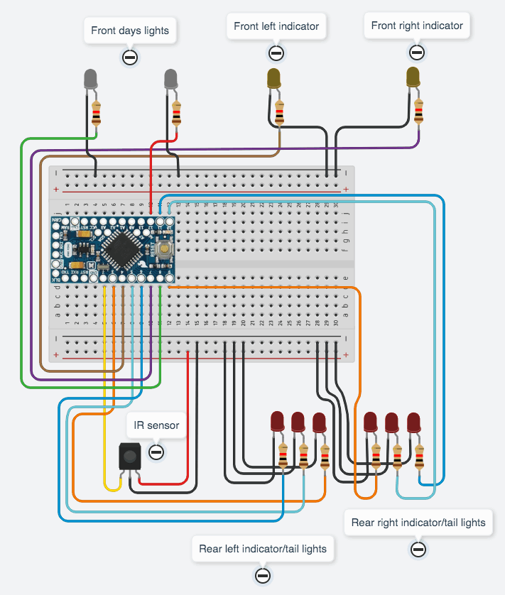

# Arduino Scripts for Ford Mustang

(https://www.youtube.com/watch?v=4ME1MtxgZ0U)

The scripts allows:
 * Turn on/off front and rear days lights.
 * Turn on/off front and rear indicators. Rear indicators are animated by using three LEDs.
 * Turn on/off the emergency lights. If enabled the rear indicators are not animated (as the real car).

TODO:
 * Implement the stop lights.
 
### Circuit diagram
 
